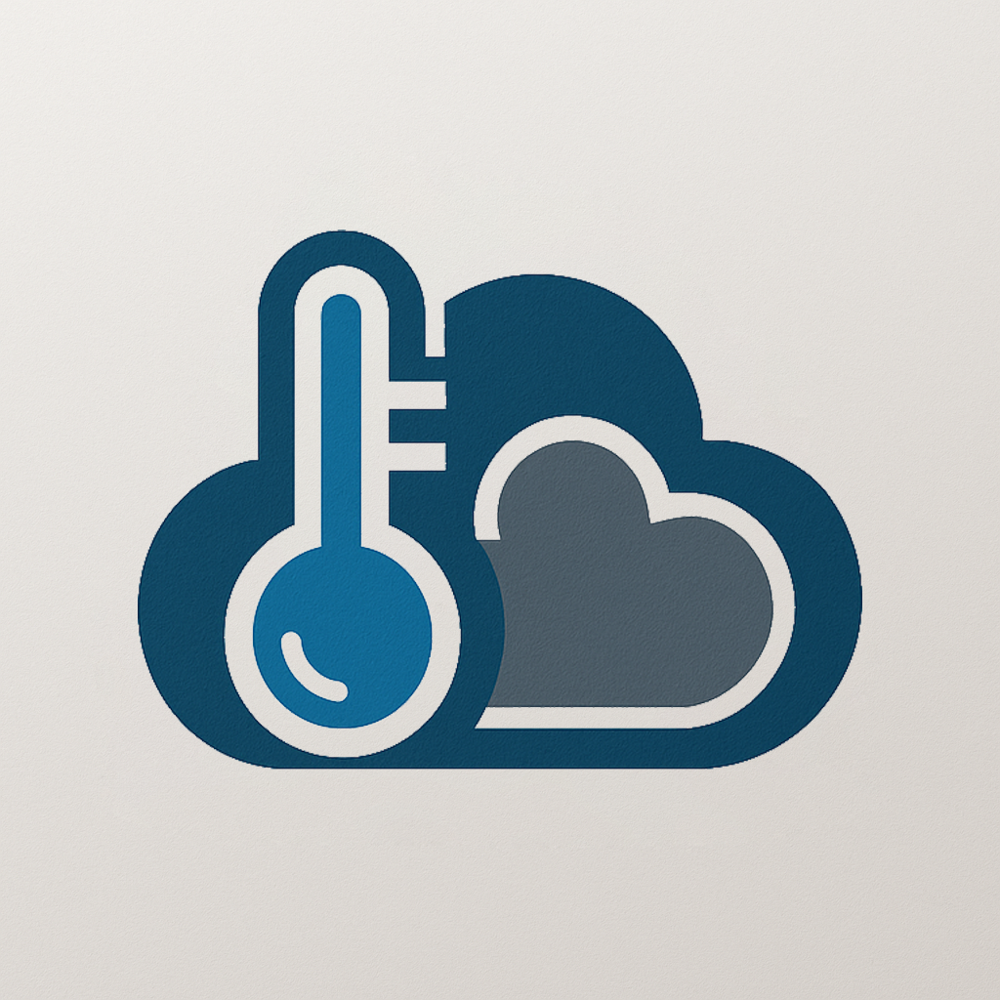

# TempCloud ☁️

Monitoramento em tempo real da Sala de Servidores Cloud.

## 🚀 Sobre o projeto

O **TempCloud** é uma aplicação web responsiva para monitoramento de temperatura em salas de servidores, exibindo dados em tempo real, gráficos históricos e alertas críticos. Desenvolvido como projeto acadêmico para a cadeira de Sistemas Embarcados.

## Funcionalidades

- Visualização da temperatura atual, máxima, mínima e média
- Gráfico em tempo real dos últimos minutos
- Alerta visual quando a temperatura ultrapassa 40°C
- Progressive Web App (PWA): instale no celular ou desktop
- Interface responsiva e otimizada para mobile

## Tecnologias

- **Frontend:** HTML5, CSS3, JavaScript (ES6), [Chart.js](https://www.chartjs.org/)
- **Backend/Sensor:** Python
- **API:** [TagoIO](https://tago.io/) para armazenamento e consulta dos dados
- **Deploy:** [Vercel](https://vercel.com/)

## 👨‍💻 Créditos

Desenvolvido por **Luca Aguiar**  
Projeto acadêmico — Sistemas Embarcados  

---

